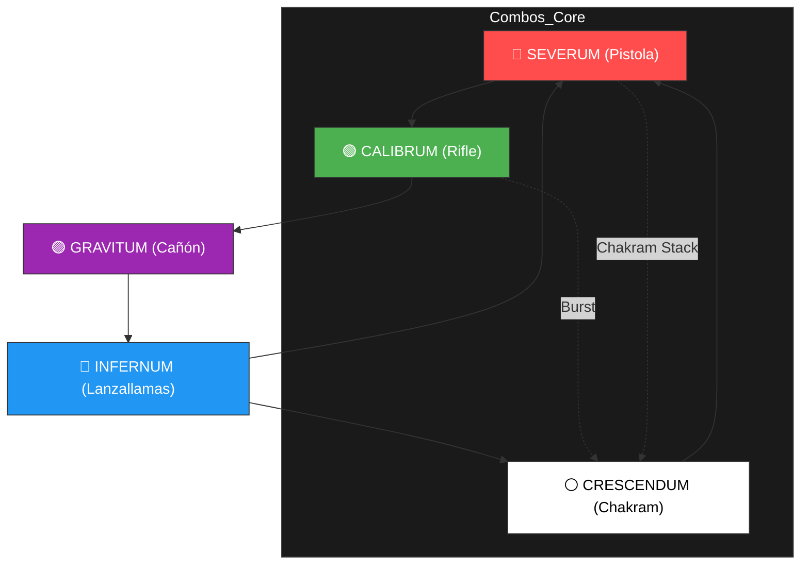

# <p align="center">🔮 ALUNE.SYS - APHELIOS SYSTEM OS 🔮</p>

<p align="center">
  
  
  
</p>

---

## `[//] INICIANDO SECUENCIA DE ARRANQUE...`

```javascript
/* ORACLE_RIFT_CORE_INITIALIZATION */
const Aphelios = {
    passive: "The Hitman and the Seer",
    weapons: ["Calibrum", "Severum", "Gravitum", "Infernum", "Crescendum"],
    ammo: 50,
    status: "READY_FOR_ASCENSION",
    mastery_tier: "GRANDMASTER+"
};

console.log(`[SYS] Alune: "So many weapons, Aphelios. You have the deadliest."`);
```

---

## 📖 Tabla de Contenidos
1.  [Ciclo Perfecto de Armas (The Apex Rotation)](#-1-ciclo-perfecto-de-armas)
2.  [Matriz de Matchups (Master+ Global)](#-2-matriz-de-matchups)
3.  [Matriz de Sinergias (Supports)](#-3-matriz-de-sinergias)
4.  [Macro-Gaming Protocol (Fases de Partida)](#-4-macro-gaming-protocol)
5.  [Ejecución Mecánica (Visual Database)](#-5-ejecucion-mecanica)
6.  [Protocolos de Combate (Consejos del Analista)](#-6-protocolos-de-combate)

---

## 🌀 1. Ciclo Perfecto de Armas (The Apex Rotation)

El orden de las armas es lo que separa a un usuario de Aphelios de un **System Master**. 

Este diagrama muestra la rotación óptima para mantener la sinergia de combos en cada fase de la partida.



---

## 📊 2. Matriz de Matchups (Master+ Global)

Base de datos analítica sobre el meta actual.

| ADC Enemigo | Clase de Riesgo | Support Synergy | Win Rate | Micro-Strategy (2026) |
| :--- | :---: | :--- | :---: | :--- |
| **Zeri** | 🟡 Tier B | Milio / Lulu | 51.5% | Castigar early con Calibrum range advantage. Gravitum para detener su R/E. |
| **Jinx** | 🔴 Tier S | Thresh / Nautilus | 48.2% | Escala igual. Infernum R en teamfights gana la pelea sola si se agrupan. |
| **Draven** | 💀 Tier S+ | Pyke / Leona | 45.0% | **PELIGRO MÁXIMO**. Sobrevivir con Severum para sustain. No tradear antes de nivel 6. |
| **Ezreal** | 🟢 Tier C | Karma / Bard | 53.8% | Línea tranquila. Stackear Crescendum detrás de minions y obligar a dive. |
| **Lucian** | 🔴 Tier S | Nami / Milio | 47.5% | **Burst Alert**. Mantener distancia con Calibrum. Gravitum para repeler su Dash (E). |
| **Kai'Sa** | 🟡 Tier B | Nautilus / Leona | 50.1% | Evitar trades cortos aislados. Infernum castiga si se esconde en minions. |

---

## 🤝 3. Matriz de Sinergias (Supports)

El rendimiento de Aphelios depende de su escudero.

| Support | Tier | Arma Óptima | Tipo de Línea | Explicación Técnica |
| :--- | :---: | :---: | :--- | :--- |
| **Thresh** | ⭐ Divine | Gravitum / Crescendum | Engage / Peeling | La linterna (W) compensa la falta de movilidad. `Lantern + Gravitum Root` es kill asegurada. |
| **Milio** | 🟢 S+ | Calibrum / Infernum | Hyper-Carry Buff | Aumenta el Rango de Calibrum a niveles absurdos. Buff de velocidad para kitear con Infernum. |
| **Lulu** | 🟢 S | Crescendum | Hyper-Protection | El Steroid de Attack Speed con Crescendum es el mayor DPS del juego. |
| **Nautilus** | 🟡 A | Gravitum | All-In Kill Lane | Perfecto para encadenar CC (Nautilus R -> Link de Autto -> Gravitum Root). |
| **Yuumi** | 🔴 C | Severum | AFK Meta | Mal early. Solo sirve si logras sobrevivir el laning phase. |

---

## 🧠 4. Macro-Gaming Protocol (Fases de Partida)

### 🛡️ Fase 1: Early Game (Lvl 1 - 5)
-   **Rotación**: Quemar `Severum` rápido para obtener `Gravitum`.
-   **Objetivo**: Control inteligente de la oleada. Usa `Calibrum` para lasmar last-hits si te zonzonean.
-   **Gank Set-up**: `Gravitum Q` es la única herramienta de CC. No empujes sin visión si no tienes Gravitum lista.

### ⚔️ Fase 2: Mid Game (Lvl 6 - 11) - Dragon Control
-   **Rotación**: Debes tener `Infernum` y `Gravitum` o `Crescendum`.
-   **Objetivo**: El primer dragón. Un `Infernum R` bien posicionado puede borrar a 3 enemigos agrupados.
-   **Kite Phase**: Posición extrema. Nunca estés adelante. Usa `Severum` para curarte de poke.

### 👑 Fase 3: Late Game (Lvl 11+) - Baron/Seige
-   **Rotación**: `Crescendum` + `Calibrum` (o Severum).
-   **Objetivo**: Destruir estructuras y tanques. `Crescendum` stackeado borra Baron en segundos.
-   **Teamfight**: Usa `Calibrum R` para snipear la backline enemiga antes de que empiece el choque principal si están a rango.

---

## ⚔️ 5. Ejecución Mecánica (Visual Database)

Sección reservada para demostraciones técnicas de combos avanzados.

### 🌟 Combo 1: "Moonshot Burst" (Rifle 🟢 + Lanzallamas 🔵)
> **Secuencia**: Calibrum Q -> Auto -> Cambiar Arma -> Infernum R -> Burst.
> 
> [INSERTAR_GIF_MOONSHOT_BURST_AQUÍ]

### 🛡️ Combo 2: "God Duelist" (Roja 🔴 + Blanca ⚪)
> **Secuencia**: Severum Q (Stack Chakrams) -> Cambiar a Crescendum -> Auto-attacks cercanos.
> 
> [INSERTAR_GIF_GOD_DUELIST_AQUÍ]

### 🌌 Combo 3: "The 4-Weapon Sentence" (Masterclass ⭐)
> **Secuencia**: `Severum Q` (Queda con 1 bala) -> Cae `Gravitum` -> `Calibrum Q` (Aplica Gravitum) -> `Gravitum Q` (Root) -> `Infernum R`.
> 
> [INSERTAR_GIF_4_WEAPON_SENTENCE_AQUÍ]

---

## 💡 6. Protocolos de Combate (Consejos del Analista)

> [!IMPORTANT]
> **Gestión de Munición**: Nunca entres a una pelea de dragón con menos de 10 balas en tu arma actual si no tienes la rotación lista. Una mala transición de armas en teamfight es muerte segura.

> [!TIP]
> **Crescendum Sinergy**: El daño de Crescendum aumenta exponencialmente con cada Chakram activo. Usa habilidades de soporte (como torretas de Calibrum o Severum Q) para cargar el stack antes de hacer el *all-in*.

---

## 🛠️ 7. Estructura del Sistema

- [`matchups.json`](./matchups.json): Base de datos en JSON con estadísticas de campeones ampliadas.
- [`builds.yml`](./builds.yml): Configuraciones de objetos dinámicas.
- [`scripts/combos.md`](./scripts/combos.md): Manual de mecánicas para el campo de pruebas.

---
<p align="center"><i>"The moon will guide us." - Alune</i></p>
